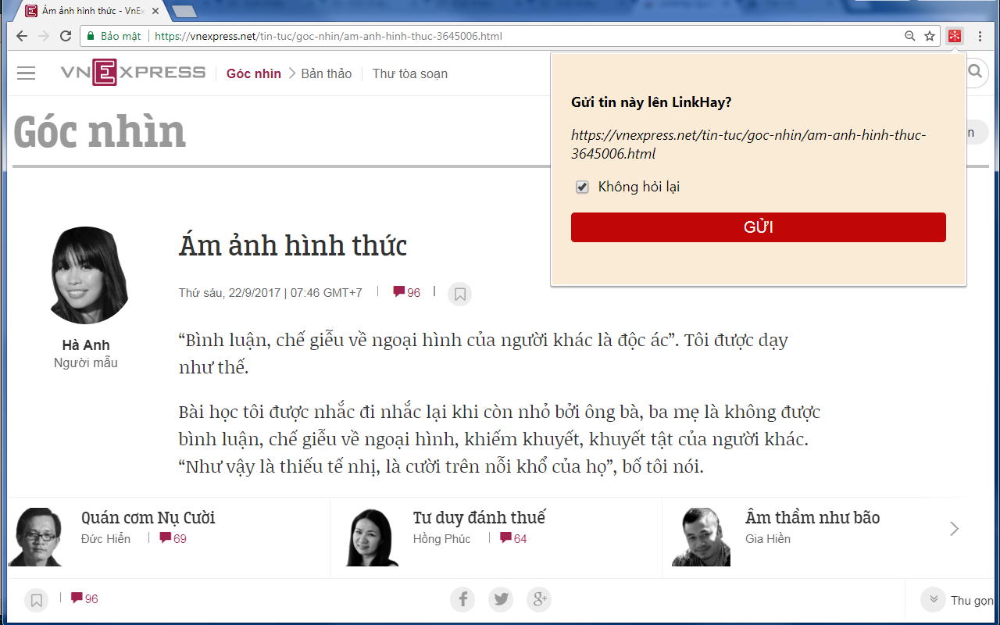

# QuickView Extension for LinkHay
Tiện ích mở rộng dùng cho trình duyệt (browser extension).

Dành cho bạn đọc của [LinkHay.com](http://LinkHay.com).

1. Thêm nút "Xem nhanh" vào màn hình để xem bài viết siêu nhanh ngay trong LinkHay mà không cần nhảy ra ngoài
2. Hỗ trợ gửi link từ bất kỳ trang nào bằng cách bấm icon LinkHay ở bên phải thanh địa chỉ của trình duyệt
3. Tự động đọc thông tin tít chính, tít phụ, ảnh đại diện khi gửi link

<a href="https://chrome.google.com/webstore/detail/linkhay-quickview/jdiingledcmkbdenjnfelcoomapkcbpm?hl=vi"></img></a>
<a href="https://chrome.google.com/webstore/detail/linkhay-quickview/jdiingledcmkbdenjnfelcoomapkcbpm?hl=vi"></img></a>

[Link cài đặt trên Google Chrome Store (dùng được cho cả Cốc Cốc)](https://chrome.google.com/webstore/detail/linkhay-quickview/jdiingledcmkbdenjnfelcoomapkcbpm?hl=vi)

QuickView cần quyền truy cập các trang web để tạo bản "Xem nhanh" (CORS). Ngoài ra,  không làm gì khác.

Phát triển bởi [Măng Cụt Labs](http://www.mangcut.vn/) ([@thinker](http://linkhay.com/u/thinker) trên LinkHay).
